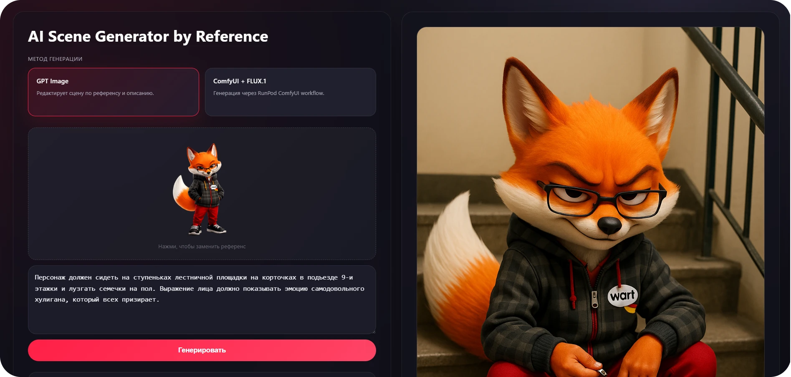

# AI Scene Generator by Reference

A full-stack AI tool that generates a new image of a character in any scene — based on a reference image and a plain-language description — without changing the character's identity.



**Live demo:** [ai-image-generator on Vercel](#) <!-- replace with actual URL -->

---

## Table of Contents

- [Purpose](#purpose)
- [Features](#features)
- [AI Pipeline](#ai-pipeline)
- [Model Comparison & Conclusion](#model-comparison--conclusion)
- [Tech Stack](#tech-stack)
- [Project Structure](#project-structure)
- [Getting Started](#getting-started)
- [Environment Variables](#environment-variables)
- [API Routes](#api-routes)

---

## Purpose

The core problem: you have a character and you want to place them in a new situation — a different scene, pose, or environment — without redesigning or losing who they are. Generic image generators don't understand "same character, new scene"; they either ignore the reference or produce someone who merely resembles the original.

This tool is built around one specific task:

1. Upload a **reference image** of the character
2. Write a **short, natural description** of the next scene in any language — just describe what's happening, no prompt engineering required
3. Get a generated image where the same character appears in that scene with preserved face, clothing, hairstyle, art style, and proportions

---

## Features

- **Two generation modes** for direct comparison:
  - **GPT Image** — OpenAI `gpt-image-1` via the image edits API
  - **ComfyUI + FLUX.1** — custom ComfyUI workflow running on RunPod serverless GPU
- **Automatic prompt engineering** — the user's raw input (any language) is automatically transformed into a structured, professional English image prompt before generation; the user never needs to know how to write prompts
- **Character identity preservation** — a carefully designed system prompt instructs the model to treat the reference image as the single source of truth for all character attributes
- **Real-time progress tracking** during generation
- **One-click download** of the generated image
- **Mobile responsive** layout

---

## AI Pipeline

The user only writes what's happening in the scene — in their own words, in any language. All prompt engineering happens automatically on the server.

```
User writes a plain description of the scene
e.g. "она сидит у окна и читает письмо"
        │
        ▼
┌─────────────────────────────────────────────┐
│  Stage 1 — Prompt Engineering               │
│                                             │
│  GPT-4o-mini takes the raw input and:       │
│  · translates it to English if needed       │
│  · expands it into a visual scene:          │
│    pose, gaze, body language, environment,  │
│    camera angle, composition                │
│  · strips any character identity from it   │
│    (face/clothing are handled by reference) │
│                                             │
│  Output: clean English scene prompt         │
└──────────────────────┬──────────────────────┘
                       │
                       ▼
┌─────────────────────────────────────────────┐
│  Stage 2 — Prompt Assembly                  │
│                                             │
│  The scene prompt is appended to a          │
│  professional system prompt that instructs  │
│  the model to:                              │
│  · preserve all character traits 1-to-1    │
│    from the reference image                 │
│  · be creative only with situation,         │
│    pose, background, and composition        │
│  · match the art style of the reference     │
└──────────────────────┬──────────────────────┘
                       │
                       ▼
           ┌───────────────────┐
           │  Generation mode  │
           └────────┬──────────┘
                    │
      ┌─────────────┴──────────────┐
      │                            │
      ▼                            ▼
┌───────────────┐      ┌──────────────────────────┐
│   GPT Image   │      │    ComfyUI + FLUX.1       │
│               │      │                          │
│  gpt-image-1  │      │  RunPod serverless GPU   │
│  /images/edits│      │  ComfyUI workflow:       │
│               │      │  CheckpointLoader        │
│  Reference +  │      │  CLIPTextEncode ×2       │
│  assembled    │      │  FluxGuidance            │
│  prompt sent  │      │  KSampler                │
│  as FormData  │      │  VAEDecode → SaveImage   │
│               │      │                          │
└──────┬────────┘      │  With reference:         │
       │               │  LoadImage → VAEEncode   │
       │               │  img2img, denoise 0.72   │
       │               └────────────┬─────────────┘
       │                            │
       └──────────────┬─────────────┘
                      │
                      ▼
             Generated image
```

---

## Model Comparison & Conclusion

The two modes were tested side-by-side on the same reference images and scene descriptions to evaluate which model better preserves character identity.

### GPT Image (`gpt-image-1`)

Uses OpenAI's image editing API: the reference image and the assembled prompt are sent together as a multimodal request. The model has direct visual access to the reference at inference time and conditions its output on it natively.

**Result:** strong character consistency across generations. Face structure, clothing details, hairstyle, and art style are reliably retained even across significant scene changes. The model treats the reference as a hard constraint rather than a soft suggestion.

### ComfyUI + FLUX.1-dev

Uses a latent diffusion approach: the reference image is encoded into the latent space via `VAEEncode` and used as the starting point for the KSampler (img2img at denoise 0.72). Character information is carried through the latent, but FLUX.1 was trained as a text-to-image model — reference conditioning via img2img is a workaround, not a native capability.

**Result:** the model produces high-quality images and follows the scene description well, but struggles to maintain precise character identity — particularly fine facial features, specific clothing patterns, and stylistic nuance. At denoise 0.72, the balance between reference adherence and prompt following is a compromise: lower denoise keeps the character closer but reduces scene creativity; higher denoise improves the scene but drifts from the reference.

To achieve results comparable to GPT Image, this pipeline would require additional fine-tuning steps: training a LoRA or IP-Adapter on the specific character, or integrating a dedicated face/identity preservation node (e.g. InstantID, IPAdapter FaceID) into the ComfyUI workflow.

### Conclusion

**GPT Image is the better fit for this task.** When the goal is character identity preservation with minimal setup — upload one reference, get consistent results — the native multimodal conditioning of `gpt-image-1` outperforms the img2img workaround used with FLUX.1. ComfyUI + FLUX.1 remains a powerful option for cases where fine-tuning per character is feasible and maximum stylistic control is needed.

---

## Tech Stack

| Layer                   | Technology                                                   |
| ----------------------- | ------------------------------------------------------------ |
| Framework               | Next.js 15 (App Router)                                      |
| UI                      | React 19                                                     |
| Language                | TypeScript                                                   |
| Styling                 | Plain CSS (CSS custom properties, no framework)              |
| AI — Prompt engineering | OpenAI `gpt-4o-mini` via Chat Completions API                |
| AI — Image mode 1       | OpenAI `gpt-image-1` via Images Edits API                    |
| AI — Image mode 2       | RunPod serverless + ComfyUI + FLUX.1-dev-fp8                 |
| Deployment              | Vercel (serverless, zero-config for Next.js)                 |
| Security                | All API keys server-side only — never exposed to the browser |

---

## Project Structure

```
src/
├── app/                              # Next.js App Router
│   ├── layout.tsx                    # Root HTML layout + metadata
│   ├── page.tsx                      # Entry point — renders GeneratorPage
│   ├── globals.css                   # Global styles (dark theme, CSS vars)
│   └── api/                          # Server-side Route Handlers
│       ├── improve-prompt/
│       │   └── route.ts             # POST → OpenAI Chat Completions
│       ├── generate-dalle/
│       │   └── route.ts             # POST → OpenAI Images Edits
│       └── generate-runpod/
│           ├── route.ts             # POST → RunPod /run (start job)
│           └── status/[jobId]/
│               └── route.ts         # GET  → RunPod /status (poll job)
│
├── features/
│   └── generator/                   # Self-contained feature module
│       ├── components/
│       │   ├── GeneratorPage.tsx    # Root component, layout
│       │   ├── ModeSelect.tsx       # GPT Image / FLUX.1 toggle cards
│       │   ├── ReferenceUpload.tsx  # Click-to-upload reference image
│       │   └── ImagePreview.tsx     # Result panel: image / spinner / error
│       ├── hooks/
│       │   └── useGenerator.ts      # All generation state and async logic
│       └── api/                     # Client-side callers (hit /api/*)
│           ├── improvePrompt.ts
│           ├── dalle.ts
│           └── runpod.ts            # Submits job + polls status
│
└── shared/
    ├── types/
    │   └── index.ts                 # AppState, RunpodResponse, ImageConfig…
    ├── prompts/
    │   └── index.ts                 # CHANGE_DESCRIPTION_PROMPT, GENERETE_IMAGE_PROMPT…
    └── lib/
        └── runpod-workflow.ts       # ComfyUI JSON workflow builder (server-side only)
```

The architecture follows **feature-oriented** principles: all code related to the generator (UI, state, API calls) lives in `features/generator/`. Code shared across features lives in `shared/`. Next.js routing and infrastructure live in `app/`.

---

## Getting Started

**Requirements:** Node.js 18+, npm

```bash
# 1. Clone and install
git clone https://github.com/RuslanMirasov/AI-image-generator.git
cd AI-image-generator
npm install

# 2. Configure environment variables
cp .env.example .env.local
# Fill in the values — see Environment Variables below

# 3. Run locally
npm run dev
# → http://localhost:3000

# 4. Production build (optional)
npm run build
npm run start
```

---

## Environment Variables

Create `.env.local` in the project root (never commit this file):

```env
OPENAI_API_KEY=sk-...
RUNPOD_API_KEY=...
RUNPOD_ENDPOINT_ID=...
```

| Variable             | Where to get it                                               |
| -------------------- | ------------------------------------------------------------- |
| `OPENAI_API_KEY`     | [platform.openai.com](https://platform.openai.com) → API Keys |
| `RUNPOD_API_KEY`     | [runpod.io](https://runpod.io) → Settings → API Keys          |
| `RUNPOD_ENDPOINT_ID` | RunPod → Serverless → your ComfyUI endpoint ID                |

All variables are **server-side only**. The browser never sees them — it only calls `/api/*` routes on the same origin.

For Vercel: add the variables in **Project → Settings → Environment Variables**.

---

## API Routes

All routes are Next.js Route Handlers (Node.js serverless functions on Vercel).

| Method | Route                                 | Description                                           |
| ------ | ------------------------------------- | ----------------------------------------------------- |
| `POST` | `/api/improve-prompt`                 | Rewrites scene description via `gpt-4o-mini`          |
| `POST` | `/api/generate-dalle`                 | Generates image via `gpt-image-1` image edits         |
| `POST` | `/api/generate-runpod`                | Submits ComfyUI job to RunPod, returns `jobId`        |
| `GET`  | `/api/generate-runpod/status/[jobId]` | Polls RunPod job status, returns result when complete |
